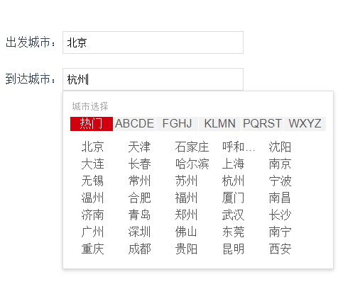

## vue-city-pinyin

#### Project setup

````
npm install vue-city-pinyin china-city-data 
````

####Demo


````base
# main.js
import Vue from 'vue';
import CityPinyin from 'vue-city-pinyin';
Vue.use(CityPinyin);
````

````base
# App.vue
<CityPinyin :value="startCity" @on-change="onChange($event,0)" msg="出发城市"/>
<CityPinyin :value="endCity" @on-change="onChange($event,1)" msg="到达城市"/>
data() {
    return {
        startCity: {
          id: '',
          name: '',
        },
        endCity: {
          id: '',
          name: '',
        }
    }
},
methods: {
onChange(item, idx) {
    console.log(idx, item);
    if (!idx) {
      this.startCity = item;
    } else {
      this.endCity = item;
    }
  }
}
````
